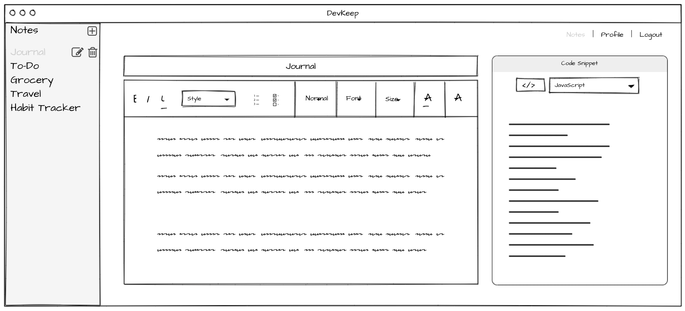
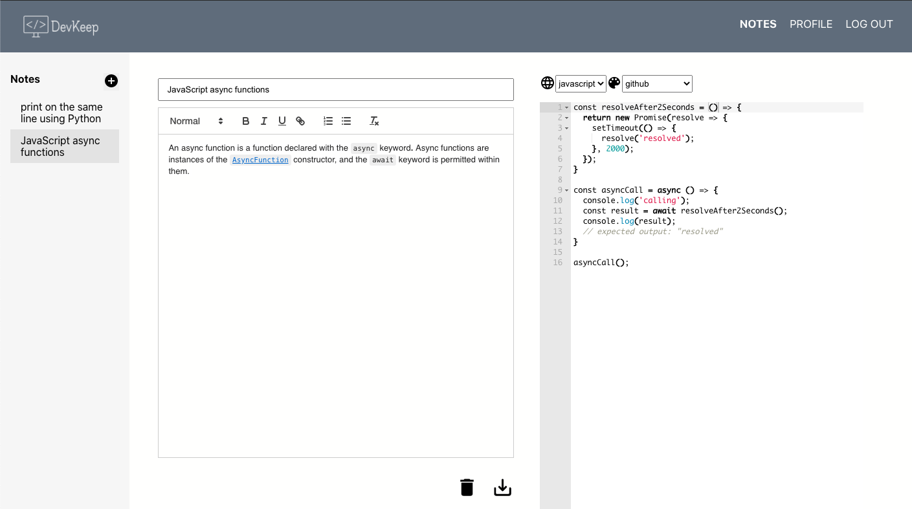

## Introduction
Your not so typical note taking app, geared for developers, with a twist to add code snippets & syntax highlights, as well as themed code editor.

## Demo
- Live demo: https://rgaban.github.io/devkeep/

## Features
- Supports Optimistic UI Rendering! 🎉  For an improved & snappier user experience.
- Authentication to keep user notes protected.
- Create, read, update, and delete notes with rich text editors.
- Auto-Save functionality upon adds & edits.
- Notification system with any note actions.
- Code language syntax highlights & code editor themes.

## Wireframe

## Usage

## Technologies & Plugins
- Frontend: React.js
- Backend: [Supabase.io](https://app.supabase.io/): hosted PostgreSQL database with restful API using Supabase.js
- [react-quill](https://www.npmjs.com/package/react-quill)
- [react-ace](https://www.npmjs.com/package/react-ace)
- [react-toastify](https://www.npmjs.com/package/react-toastify)
